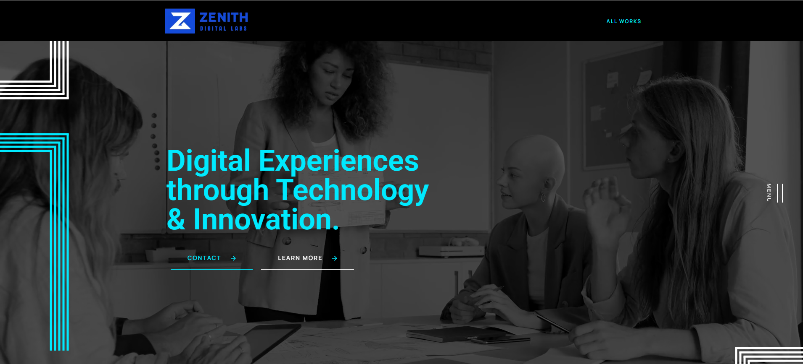
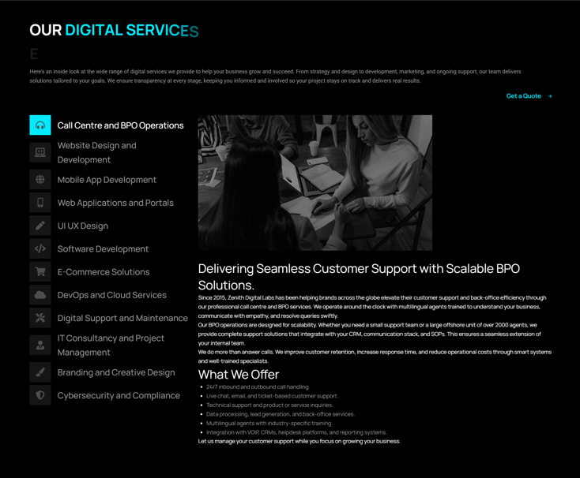

# Zenith Digital Labs – Case Study  

A modern, responsive business website for **Zenith Digital Labs**, built with WordPress and Elementor to strengthen the agency’s digital presence.  

## 📌 Project Overview  
The goal was to design and develop a fast, SEO-friendly business website for a digital marketing agency. The project focused on a clean, professional layout, smooth navigation, service-specific pages with FAQs, and performance optimization for both desktop and mobile.  

## 🛠 Tech Stack  
- WordPress  
- Elementor & Elementor Pro  
- LiteSpeed Cache  
- HTML, CSS, JavaScript  
- SEO optimization tools  

## 👩‍💻 My Role  
- Front-end development (Elementor & custom CSS tweaks)  
- Theme customization for branding consistency  
- Performance optimization (image compression, caching, code cleanup)  
- Structuring content and formatting service pages with FAQs  

## 🎯 Key Results  
- Improved site load time and responsiveness  
- Enhanced SEO performance with optimized structure & metadata  
- Clear navigation that improved user flow across services  
- Added FAQ sections per service to boost authority & engagement  

## ⚡ Challenges & Solutions  
**Challenge:** Handling a large number of services with unique FAQs without cluttering the main page.  
**Solution:** Implemented **tabbed service sections** and a dedicated FAQ layout to keep the site structured, user-friendly, and SEO-optimized.  

## 🔗 Live Project  
[Visit Zenith Digital Labs](https://zenithdigitallabs.com/)  

## 🖼 Screenshots  

📂 View Screens
  

  
  
  

